# Criação de Skills — Refatoração Arquitetural Automatizada

## Análise Manual

### Projeto 1 — code-smells-project 

| Severidade | Problema | Localização | Observações |
|:----------:|:--------:|:-----------:|:-----------:|
| CRITICAL | SQL Injection | `models.py:28`| vulnerabilidade de SQL Injection devido ao tratamento inadequado de entradas do usuário em consultas ao banco de dados |
| CRITICAL | SQL Injection | `models.py:48`| vulnerabilidade de SQL Injection devido ao tratamento inadequado de entradas do usuário em consultas ao banco de dados |
| CRITICAL | SQL Injection | `models.py:110`| vulnerabilidade de SQL Injection devido ao tratamento inadequado de entradas do usuário em consultas ao banco de dados |
| CRITICAL | SQL Injection | `models.py:291`| vulnerabilidade de SQL Injection devido ao tratamento inadequado de entradas do usuário em consultas ao banco de dados |
| CRITICAL | Endpoints com função de admin sem autenticação: `reset-db` (DELETE em massa) e `query` (SQL cru do body) | `app.py:47-78` | Qualquer pessoa apaga o banco ou executa SQL arbitrário|
| MEDIUM | Queries N+1 em listagens de pedidos e relatório de vendas | `models.py:171-233` | Cursores aninhados em loop; degrada de ms para segundos em produção. |
| MEDIUM | Código duplicado de validação `if "nome" not in dados`| `controllers.py: 30-35` `controllers.py: 72-74` | A mesma lógica aparece em vários endpoints. |
|LOW|	Magic numbers | `models.py:257`| valores numéricos fixos escritos diretamente no código, sem uma explicação ou um nome que indique seu significado |
|LOW|	Logs não estruturados com uso de `ptint()`| `controllers.py:8-11-57...`| Sem níveis, timestamps |

### Projeto 2 - ecommerce-api-legacy

| Severidade | Problema | Localização | Observações |
|:----------:|:--------:|:-----------:|:-----------:|
| CRITICAL | **Secrets hardcoded**  | `src/utils.js:3-5` | senha de banco "de produção" e chave live de gateway no código |
| CRITICAL |Exposição de dados sensíveis via log| `src/AppManager.js:45`| número do cartão e a chave do gateway impressos em log|
| CRITICAL | God Class misturando banco, rotas e regras de negócio | `src/AppManager.js:4-139` | uma única classe concentra responsabilidades demais, tornando-se responsável por praticamente toda a lógica da aplicação |
| MEDIUM | Queries N+1 no relatório financeiro: 1 query por curso + 1 por matrícula (usuário) + 1 por matrícula (pagamento)| `src/AppManager.js:83-128` | Muitas consultas ao banco em vez de JOINs |
| MEDIUM | Falta de validação de `payment.amount` | `src/AppManager.js:4-139` | Pode resultar em NaN ou cálculos incorretos no relatório financeiro. |
|LOW| Magic number | `src/AppManager.js:46`| valores numéricos fixos escritos diretamente no código, sem uma explicação ou um nome que indique seu significado |
| LOW | Código morto: `totalRevenue`, `globalCache`| `src/utils.js:9-10` | Engana o desenvolvedor sobre o que o sistema realmente faz. |
|LOW| meaningful names - Nomenclatura pouco descritiva | `src/AppManager.js:29-33`|variáveis `u`, `e`, `p`, `cid`, `cc`|

### Projeto 3 - task-manager-api

| Severidade | Problema | Localização | Observações |
|:----------:|:--------:|:-----------:|:-----------:|
| CRITICAL | Uso de MD5 para senhas (`set_password`/`check_password`) | `models/user.py:29` `models/user.py:32` | MD5 é rápido e sujeito a rainbow tables. O ideal é usar uma biblioteca própria para senhas|
| CRITICAL | Senha exposta no `to_dict()` | `models/user.py:16-25` | O hash trafega em respostas (inclusive login),|
| MEDIUM | Uso do `datetime.utcnow()` que é uma API deprecated | `routes/task_routes.py:31` | API deprecada partir do Python 3.12, risco em upgrades. |
| MEDIUM | Repetição de codigo para da regra de `overdue` | `routes/task_routes.py:30-39,71-80,283-287`| Poderia ser abstraido para um unico método|
| LOW | Import desnecessário | `task.py:3`| import json não usado|
| LOW | Datas usando str() em vez de isoformat() | `task.py:32`| |

## Construção da Skill

### Decisões de design

 - Skill refactor-arch vive criada em .claude/skills/refactor-arch/, copiada dentro de cada um dos 3 projetos. 
 
 - SKILL.md define 3 fases sequenciais (Análise → Auditoria → Refatoração) com 5 arquivos de referência em Markdown

- 3 fases estritamente sequenciais sendo fases 1 e 2 **read-only**

- Inicio da Fase 3 com confirmação obrigatória do usuário 

- Geração do relatório de auditoria no diretório de reports/ com classificação por severidade (CRITICAL/HIGH/MEDIUM/LOW)


### Arquivos de referências

| Arquivo | Área de conhecimento |
|---|---|
| `references/project-analysis` | Heurísticas para detectar linguagem, framework, banco e mapear arquitetura |
| `references/antipattern-catalog` | referência para identificar, avaliar e classificar anti-patterns de código |
| `references/report-template` | Formato padronizado do relatório de auditoria |
| `references/refactoring-playbook` | Guia operacional para transformar os anti-patterns identificados durante a análise em correções concretas. |
| `references/mvc-guidelines` | Regras do padrão MVC alvo (camadas e responsabilidades) |

### Anti-Patterns adicionados

O catálogo contém 12 anti-patterns, organizados em quatro níveis de severidade. A seleção foi construída para cobrir problemas que são detectáveis por análise estática ou contextual de código, sem depender de uma linguagem, framework ou arquitetura específica.

### Visão geral da cobertura

| Severidade   | Anti-Patterns                                | Principal dimensão coberta    |
| ------------ | -------------------------------------------- | ----------------------------- |
| **CRITICAL** | Injeção de comandos ou consultas             | Segurança e integridade       |
| **CRITICAL** | Exposição de credenciais ou dados sensíveis  | Segurança e confidencialidade |
| **CRITICAL** | Operação crítica sem controle de acesso      | Segurança e autorização       |
| **HIGH**     | Responsabilidade excessiva                   | Arquitetura e manutenção      |
| **HIGH**     | Acoplamento forte a implementações concretas | Arquitetura e testabilidade   |
| **HIGH**     | Estado global mutável compartilhado          | Confiabilidade e arquitetura  |
| **MEDIUM**   | Queries N+1 e operações repetitivas          | Performance e escalabilidade  |
| **MEDIUM**   | Validação ou tratamento de erro insuficiente | Robustez e confiabilidade     |
| **MEDIUM**   | Duplicação significativa de lógica           | Manutenção e consistência     |
| **LOW**      | Magic numbers e literais sem contexto        | Clareza e manutenção          |
| **LOW**      | Nomenclatura pouco expressiva                | Legibilidade                  |
| **LOW**      | Código morto e ruído de desenvolvimento      | Organização e legibilidade    |

As seções “Atenção” de cada anti-pattern foram incluídas para estabelecer limites objetivos para a classificação. Isso é especialmente importante para uma skill de análise automática, pois reduz o risco de transformar preferências de implementação, estilo ou convenções específicas de uma tecnologia em problemas reais de código.

A divisão em CRITICAL → HIGH → MEDIUM → LOW permite que a skill priorize findings pelo impacto potencial, enquanto a exigência de arquivo e linha exatos transforma a identificação dos anti-patterns em findings verificáveis, em vez de recomendações genéricas.

### Skill Agnóstica a tecnologia

O arquivo project-analysis.md é agnóstico a tecnologia principalmente porque ele não define como uma aplicação deve ser construída, mas sim como identificar evidências sobre uma aplicação que já existe.

A abordagem parte de conceitos gerais — linguagem, framework, persistência e arquitetura — e utiliza exemplos específicos apenas como sinais de detecção. 

A tecnologia é tratada como evidência, não como regra de análise

O princípio mais importante do arquivo está logo no início:

```Toda conclusão deve derivar de evidências encontradas no repositório — nunca de suposições.```

Isso torna a heurística agnóstica porque a skill não parte da premissa de que o projeto utiliza uma tecnologia específica.


## Resultados

#### code-smells-project

- Relatório de auditoria pode ser contultado em [audit-project-1.md](./reports/audit-project-1.md) 

- Relatório de refatoração pode ser consultado em [refactor-project-1.md](./reports/refactor-project-1.md)

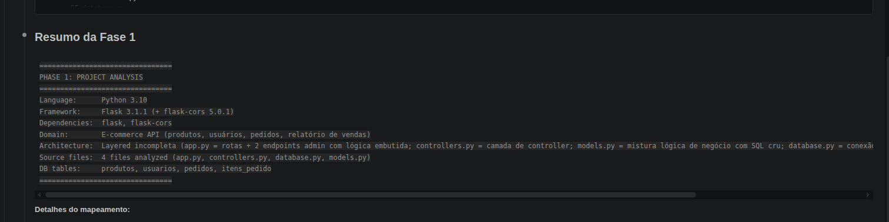
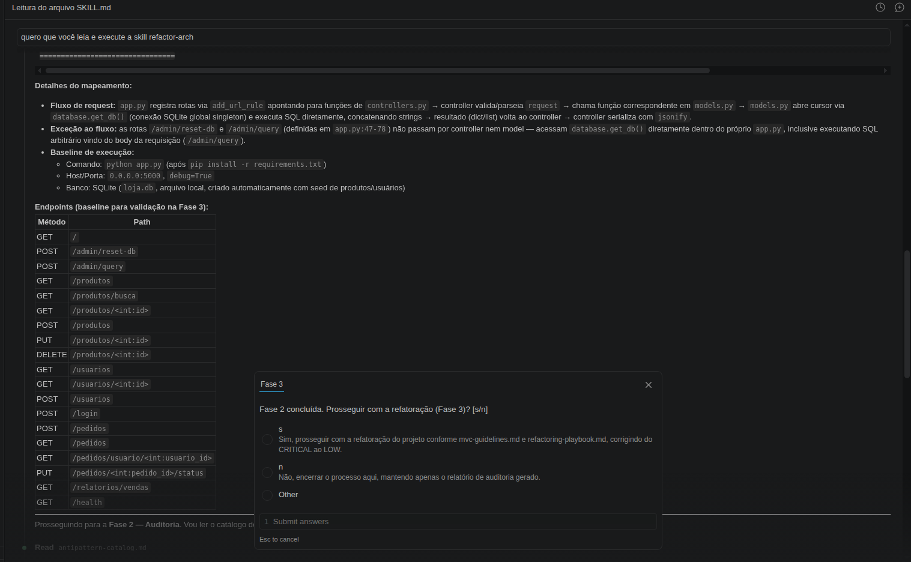
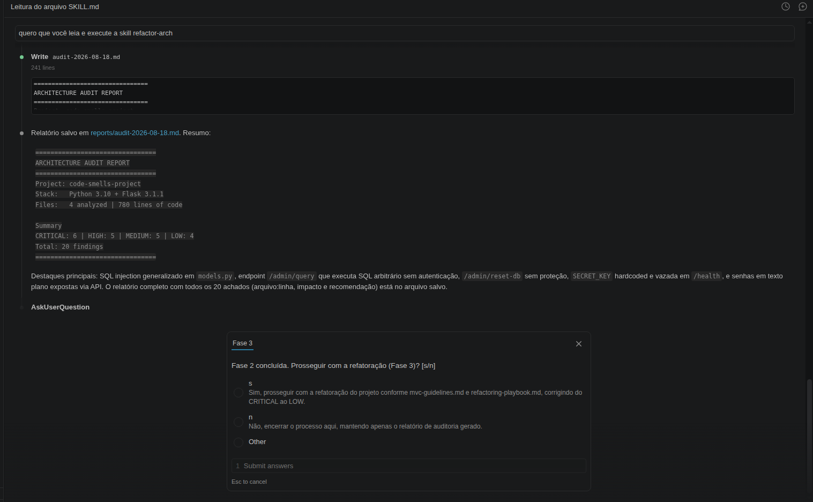
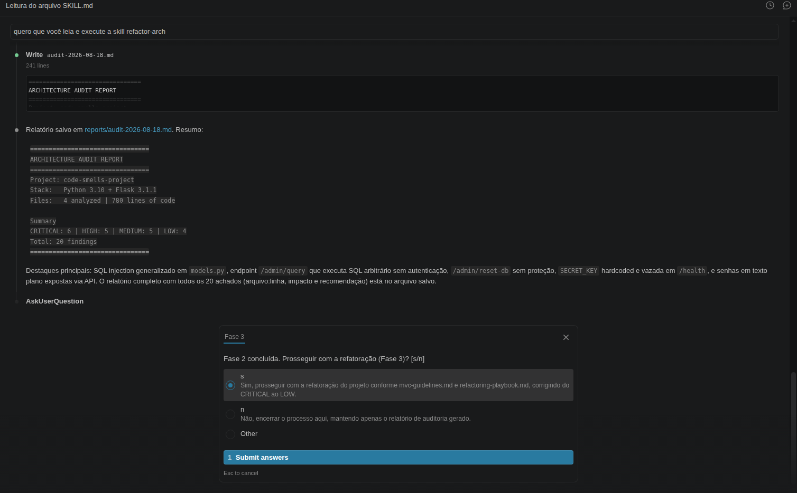
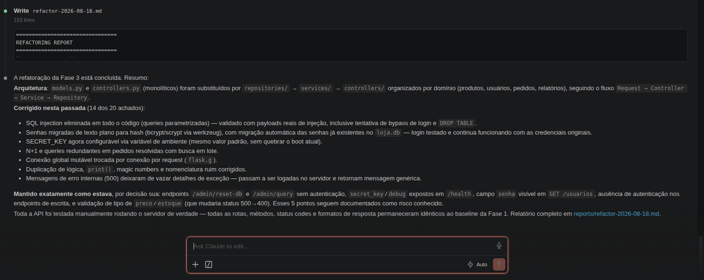
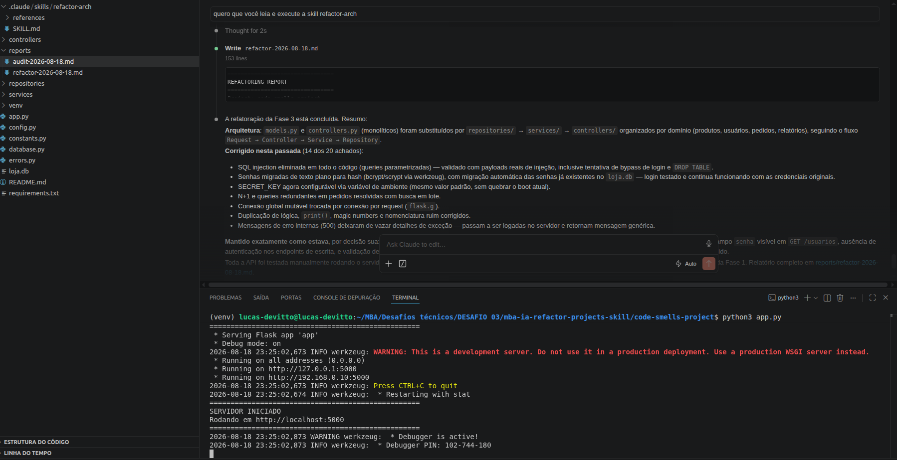

---

#### ecommerce-api-legacy

- Relatório de auditoria pode ser contultado em [audit-project-2.md](./reports/audit-project-2.md) 

- Relatório de refatoração pode ser consultado em [refactor-project-2.md](./reports/refactor-project-2.md)

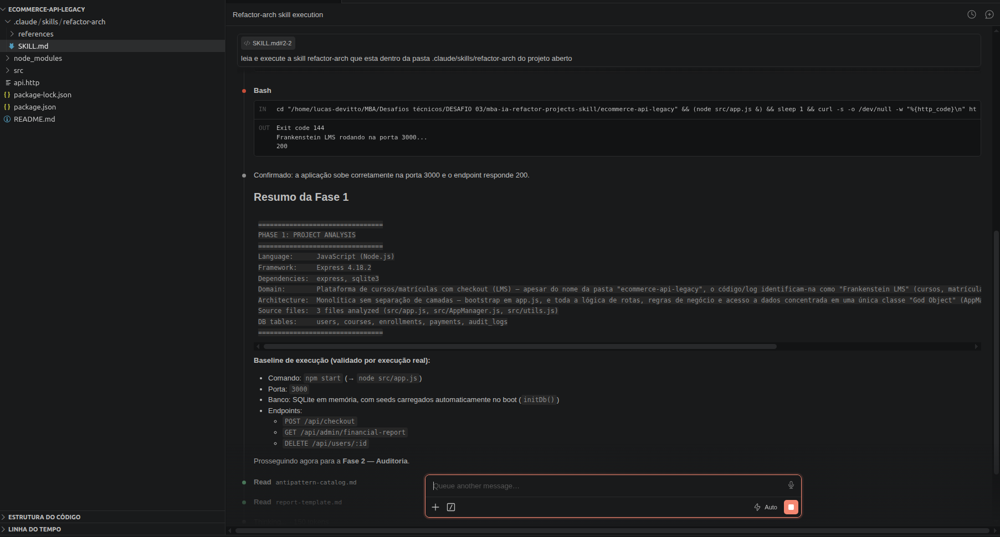
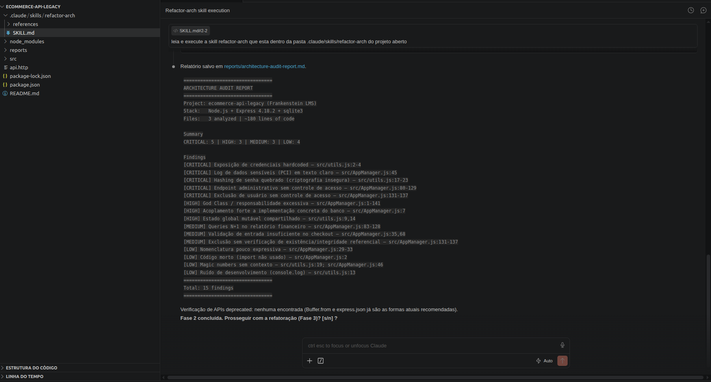
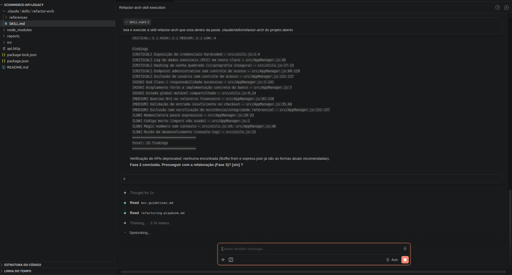
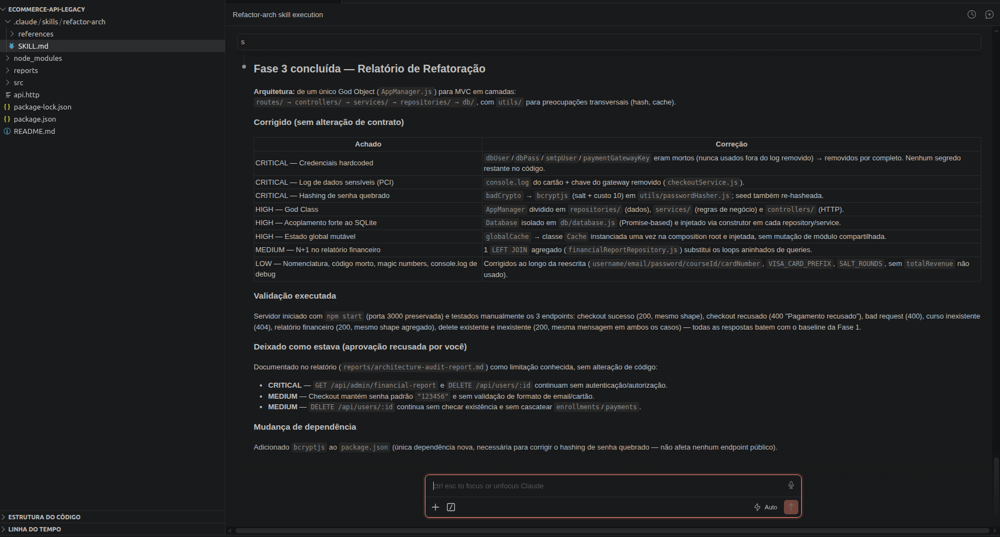
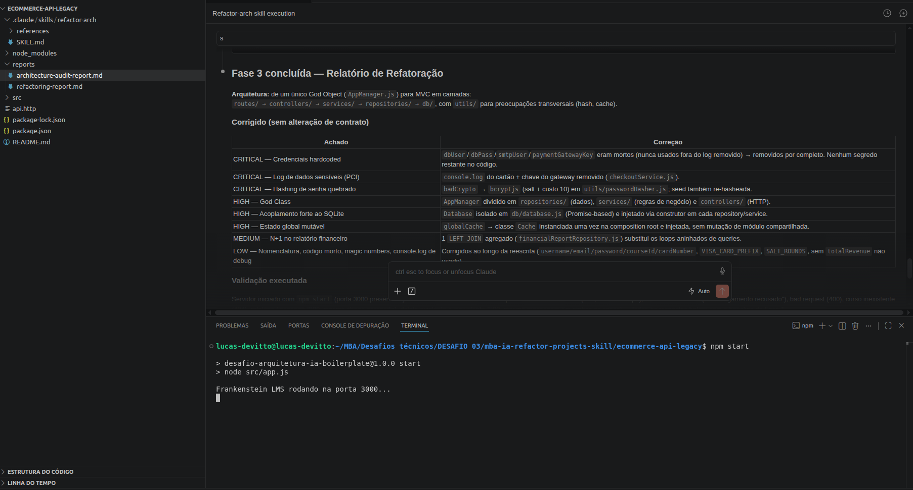

---

#### task-manager-api

- Relatório de auditoria pode ser contultado em [audit-project-3.md](./reports/audit-project-3.md) 

- Relatório de refatoração pode ser consultado em [refactor-project-3.md](./reports/refactor-project-3.md)

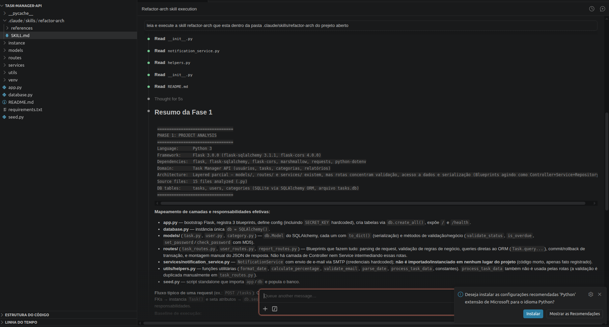
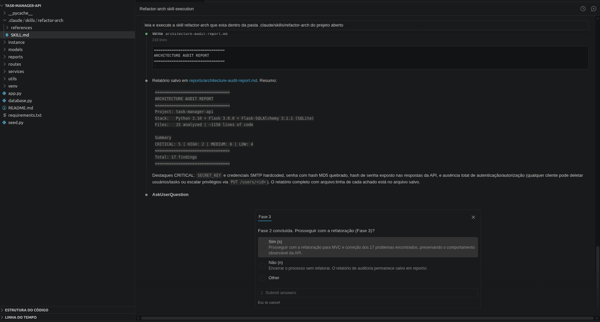
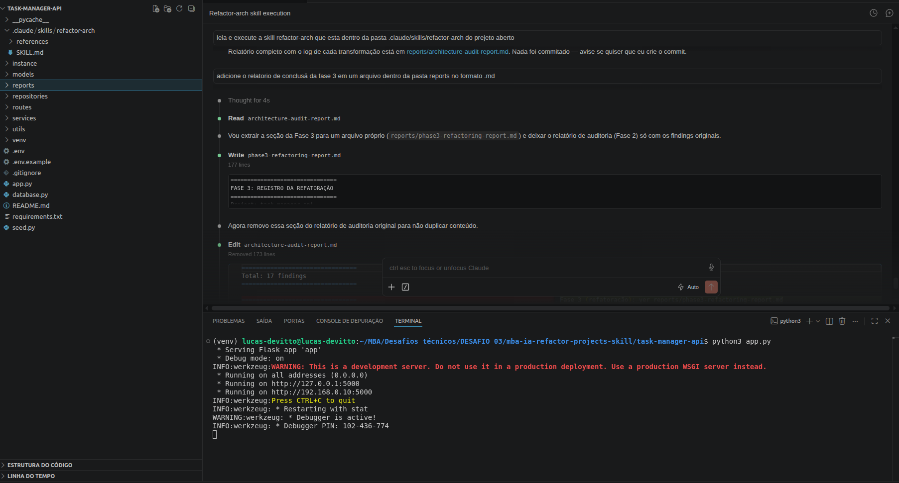
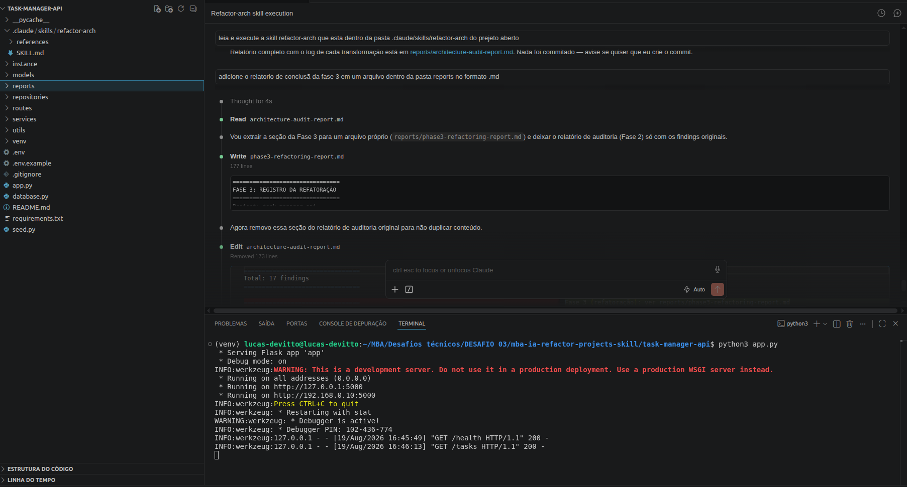

---

## Como Executar

#### Pré-requisitos

| Ferramenta | Versão mínima | Verificação |
|---|---|---|
| Claude Code CLI | latest | `claude --version` |
| Python | 3.9+ | `python3 --version` |
| Node.js | 18+ | `node --version` |
| npm | 8+ | `npm --version` |

---

### code-smells-project

```bash
# acesse a pasta do projeto
cd code-smells-project

# crie uma virtual env
python3 -m venv venv && source venv/bin/activate

# instale as dependências
pip install -r requirements.txt

# copie e edite as variaveis de ambiente se necessário
cp .env.example .env 

#caso queira definir uma chave de autenticação faça
export ADMIN_API_KEY="uma-chave-longa-e-aleatoria"
# Se o export não for feito a aplicação vai gerar uma chave aleatoria ao subir o projeto. Consulte a chave no console e envie X-Admin-Api-Key: <valor de ADMIN_API_KEY> no header em todas às requests

# execute o projeto
python app.py
```

Validação rápida:
```bash
curl -X POST http://localhost:5000/admin/reset-db \
  -H "X-Admin-Api-Key: <ADMIN_API_KEY>"

curl -X POST http://localhost:5000/produtos \
  -H "X-Admin-Api-Key: <ADMIN_API_KEY>" \
  -H "Content-Type: application/json" \
  -d '{"nome": "Produto X", "descricao": "Descrição", "preco": 10.0, "estoque": 5, "categoria": "geral"}'

  curl http://localhost:5000/usuarios \
  -H "X-Admin-Api-Key: <ADMIN_API_KEY>"
```
---

### ecommerce-api-legacy

```bash
# acesse a pasta do projeto
cd ecommerce-api-legacy

# instale as dependências
npm install

# copie e edite as variaveis de ambiente se necessário
cp .env.example .env

# execute o projeto
npm start
```

Validação rápida:
```bash

curl -s -X POST http://localhost:3000/api/checkout \
  -H "Content-Type: application/json" \
  -d '{"user_id":1,"course_id":1,"card_number":"4111111111111111","email":"test@test.com"}' | jq .

curl http://localhost:3000/api/admin/financial-report | jq .
```
--- 

### task-manager-api

```bash

# acesse a pasta do projeto
cd task-manager-api

# crie uma virtual env
python3 -m venv venv && source venv/bin/activate

# instale as dependências
pip install -r requirements.txt

# copie e edite as variaveis de ambiente se necessário
cp .env.example .env

# COMO AUTENTICAR NAS APIS APÓS O AJUSTE
# Obtenha um token chamando `POST /login` com email e senha de um usuário
# existente (veja `seed.py` para usuários de exemplo).
# O campo `token` da resposta é um JWT. Envie-o em todas as chamadas
# a endpoints protegidos no header:
#Authorization: Bearer <token>

# popula o banco (rode antes do primeiro boot)
python seed.py                 

#Execute o projeto
python app.py
```

Validação rápida:
```bash
curl -s http://localhost:5000/
curl -s http://localhost:5000/health
curl -s -X POST http://localhost:5000/login \
  -H "Content-Type: application/json" \
  -d '{"email":"joao@email.com","password":"1234"}'

# Guarde o token retornado em uma variável para os exemplos seguintes
TOKEN=$(curl -s -X POST http://localhost:5000/login \
  -H "Content-Type: application/json" \
  -d '{"email":"joao@email.com","password":"1234"}' | python3 -c "import sys,json;print(json.load(sys.stdin)['token'])")

 GET /users — público
curl -s http://localhost:5000/users

# GET /users/<id> — público
curl -s http://localhost:5000/users/1

# POST /users — público (cadastro)
curl -s -X POST http://localhost:5000/users \
  -H "Content-Type: application/json" \
  -d '{"name":"Novo Usuário","email":"novo@email.com","password":"1234"}'

# PUT /users/<id> — requer autenticação (dono ou admin)
curl -s -X PUT http://localhost:5000/users/1 \
  -H "Authorization: Bearer $TOKEN" \
  -H "Content-Type: application/json" \
  -d '{"name":"João Silva Atualizado"}'

# DELETE /users/<id> — requer autenticação (dono ou admin)
curl -s -X DELETE http://localhost:5000/users/1 \
  -H "Authorization: Bearer $TOKEN"

# GET /users/<id>/tasks — público
curl -s http://localhost:5000/users/1/tasks

--- Tasks (routes/task_routes.py) ---

# GET /tasks — público
curl -s http://localhost:5000/tasks

# GET /tasks/<id> — público
curl -s http://localhost:5000/tasks/1

# POST /tasks — requer autenticação (user_id só pode ser o do próprio token,
# a menos que o chamador seja admin)
curl -s -X POST http://localhost:5000/tasks \
  -H "Authorization: Bearer $TOKEN" \
  -H "Content-Type: application/json" \
  -d '{"title":"Nova task","user_id":1,"category_id":1}'

# PUT /tasks/<id> — requer autenticação (dono da task ou admin)
curl -s -X PUT http://localhost:5000/tasks/1 \
  -H "Authorization: Bearer $TOKEN" \
  -H "Content-Type: application/json" \
  -d '{"status":"in_progress"}'

# DELETE /tasks/<id> — requer autenticação (dono da task ou admin)
curl -s -X DELETE http://localhost:5000/tasks/1 \
  -H "Authorization: Bearer $TOKEN"

# GET /tasks/search — público
curl -s "http://localhost:5000/tasks/search?q=login&status=pending"

# GET /tasks/stats — público
curl -s http://localhost:5000/tasks/stats

--- Categorias e relatórios (routes/report_routes.py) ---

# GET /reports/summary — público
curl -s http://localhost:5000/reports/summary

# GET /reports/user/<id> — público
curl -s http://localhost:5000/reports/user/1

# GET /categories — público
curl -s http://localhost:5000/categories

# POST /categories — requer autenticação + role admin
curl -s -X POST http://localhost:5000/categories \
  -H "Authorization: Bearer $TOKEN" \
  -H "Content-Type: application/json" \
  -d '{"name":"Nova categoria","color":"#ff0000"}'

# PUT /categories/<id> — requer autenticação + role admin
curl -s -X PUT http://localhost:5000/categories/1 \
  -H "Authorization: Bearer $TOKEN" \
  -H "Content-Type: application/json" \
  -d '{"description":"Descrição atualizada"}'

# DELETE /categories/<id> — requer autenticação + role admin
curl -s -X DELETE http://localhost:5000/categories/1 \
  -H "Authorization: Bearer $TOKEN"

```
---

### Para executar a skill `refactor-arch` em um projeto

```bash
# Entre no diretório do projeto que deseja refatorar:
cd <projeto>

# execute
claude /refactor-arch
```

### Validar que a refatoração funcionou

Cada projeto expõe um endpoint `/health` que confirma que a aplicação está de pé sem expor configuração interna. Além disso, refaça os curls apresentados em cada item de validação rápida.
